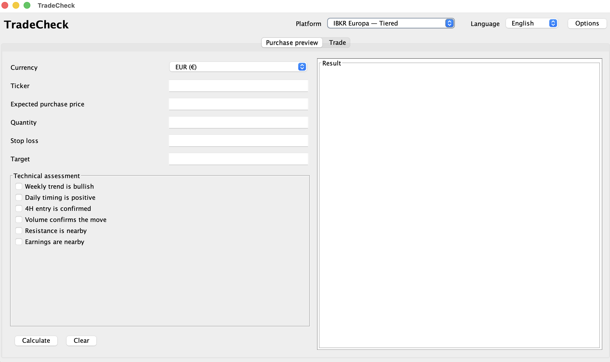

# TradeCheck

[](https://www.paypal.com/paypalme/lucamezzolla82)

> If you find TradeCheck useful or want to support its development, you can make a small donation through PayPal.  
> Your support helps improve documentation, testing, safety checks, UI polish and controlled production-readiness.

---

## Screenshots

### Main application



---

Desktop application built with **Java Swing**

## Version

1.2.1

## What's new in version 1.2.1

- Automatic commission engine applied separately to purchases and sales.
- Five predefined profiles:
  - **Fineco Italy — Trading Account**;
  - **IBKR Europe — Tiered**;
  - **IBKR Europe — Fixed SmartRouting**;
  - **IBKR USA — Tiered**;
  - **IBKR USA — Fixed**.
- Support for two calculation methods:
  - percentage of the trade value;
  - cost per share.
- Support for a minimum commission per order and three maximum commission types:
  - no maximum;
  - fixed amount;
  - percentage of the trade value.
- Configurable additional costs, separated between purchases and sales:
  - fixed amount;
  - amount per share;
  - percentage of the trade value.
- In **Trade** mode, commissions are calculated automatically.
- The purchase commission can now be derived from the executed purchase price, the broker average price and the quantity:
  - `purchase commission = (average price - executed purchase price) × quantity`;
  - the calculated field is read-only and displayed with a light-grey background.
- The actual selling commission can still be entered manually and takes precedence over the profile estimate.
- If the broker average price is not provided, TradeCheck automatically falls back to the purchase commission estimated from the selected profile.
- The break-even price now accounts for the variable selling commission and is calculated numerically.
- The panel currency is automatically aligned with the selected profile.
- The **Trade** label is used consistently in every supported language.
- The **Options** window has been enlarged and the form width has been improved to avoid horizontal scrolling.
- Automatic migration of profiles from version 1.1.0.

## Predefined profiles

The initial values are based on the publicly available pricing schedules consulted on July 17, 2026:

- Fineco Italy Trading Account: 0.19% of the trade value, minimum 2.95 EUR, maximum 19 EUR.
- IBKR Europe Tiered: 0.05% of the trade value, minimum 1.25 EUR, maximum 29 EUR, first monthly volume tier.
- IBKR Europe Fixed SmartRouting: 0.05% of the trade value, minimum 3 EUR, no stated maximum.
- IBKR USA Tiered: 0.0035 USD per share, minimum 0.35 USD, maximum 1% of the trade value, first monthly volume tier.
- IBKR USA Fixed: 0.005 USD per share, minimum 1 USD, maximum 1% of the trade value.

The IBKR USA Tiered profile also includes the known regulatory and clearing costs configured in the profile. Tiered commissions may still vary depending on the execution venue, routing and liquidity; TradeCheck reports this in the result. When the order has already been executed, entering the actual selling commission makes the calculation consistent with the broker's data.

For the purchase side, when both the executed purchase price and the broker average price are available, TradeCheck derives the purchase commission directly from those values. This is useful when the broker average price already includes purchase commissions and fees.

Official sources:

- https://it.finecobank.com/trading/conto-trading/
- https://www.interactivebrokers.com/en/pricing/commissions-stocks-europe.php
- https://www.interactivebrokers.com/en/pricing/commissions-stocks.php

> Pricing schedules may change. Profiles can be edited from the **Options** window.

The selected currency determines the symbol and formatting used in the results. TradeCheck does not perform automatic conversions between euros and US dollars. A tax estimate in USD does not replace the tax calculation in EUR using official exchange rates.

## Requirements

- Java 21
- Maven

## Build

```bash
mvn clean package
```

## Run

```bash
java -jar target/tradecheck-1.2.1.jar
```

On macOS, you can also run:

```bash
chmod +x run-macos.command
./run-macos.command
```

## Main structure

- `CommissionCalculator`: calculates base commissions, minimums, maximums and additional costs.
- `BreakEvenCalculator`: calculates the break-even price with a variable selling commission.
- `PurchasePreviewPanel`: pre-trade assessment with commissions calculated for the purchase price, stop and target.
- `CompletedTradePanel`: break-even calculation and three selling scenarios, with purchase commission derived from the broker average price and an optional actual selling commission override.
- `SettingsService`: profile storage and migration through Java Preferences.
- `OptionsDialog`: complete profile editing.
- `I18n`: English, Italian, Spanish, French and Portuguese.
